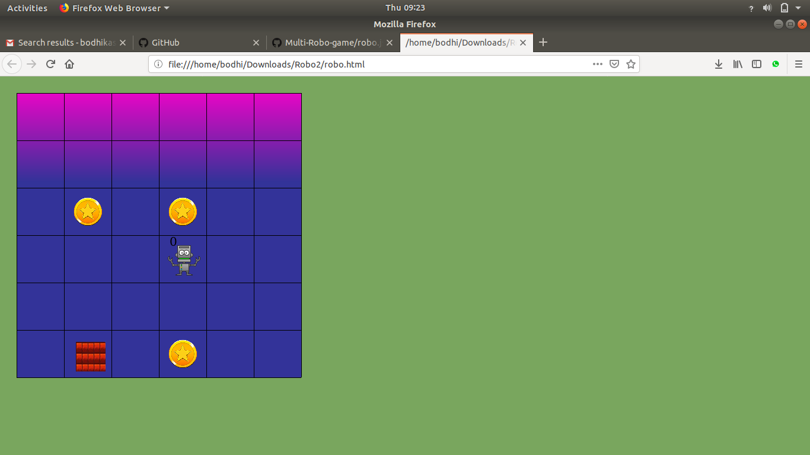

Robot Game
AUTHOR:

    Bodhivardhan Pratap Kasabe.

DESCRIPTION:

This was a mini assignment given to us for the course, CS-404: Software engineering -1 during the academic year 2016-2017, with the aim to understand the 'html', 'css' and javascript in a software.

Screenshot
BUILDING AND USING ROBOT:

Running project:

Make sure u have install html5 click on robo.html and open it into browser and project automaticaly gets executed.
Configuration:

You can configure your own grid and coin position in inputs folder and in config file. I am using 2 robots so you can provide commands of both robos an follows :-

    1st robo commands in inputs folder and in command.txt file .
    2nd robo commands in inputs folder and in robo2.txt file.

Command of robos:

command are as follows

    up - up for upward direction of robo .
    down - down for downward direction of robo .
    left - left for left direction of robo .
    right - right for right direction of robo .
    drop - drop instruction first checks for is that robo have a coin, if yes then it drop coin .

# SimpleRobotGame
